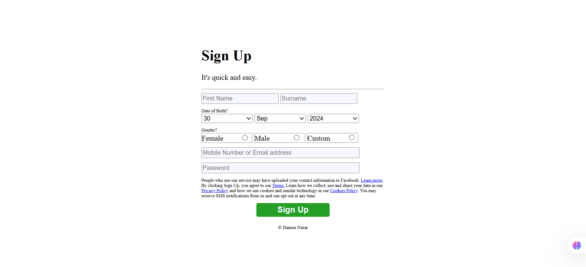

# 📋 Facebook Sign-Up Form Clone

A simple, responsive clone of the **Facebook Sign-Up form** built using HTML & CSS.  
This project was created as a practice assignment to learn form design, responsiveness, and layout styling.

---

## 🌟 Features

- 🎨 Clean and modern UI inspired by Facebook  
- 📱 **Responsive design** – works on desktop, tablet, and mobile  
- 📍 Centered form layout using Flexbox  
- 🔒 Input fields for name, email, password, DOB, and gender  
- ✅ Styled "Sign Up" button with hover effects  
- 📑 Includes terms and policy info with links  

---

## 📸 Preview



---

## 📂 Project Structure

```text
project-root/
│-- index.html       # Main HTML file  
│-- style.css        # Stylesheet (inline in this version)   
│-- preview.png      # Screenshot for README  
```
---

## ⚡ How to Run

1- Clone the repository:
git clone https://github.com/Hamna902/Facebook-Sign-up-Form.git

2- Open the project folder:
cd facebook-signup-form

3- Open index.html in your browser.

## 🛠️ Technologies Used

1- HTML5

2- CSS3 (Flexbox, Responsive Design)

## 👩‍💻 Author

Hamna Nazar

---